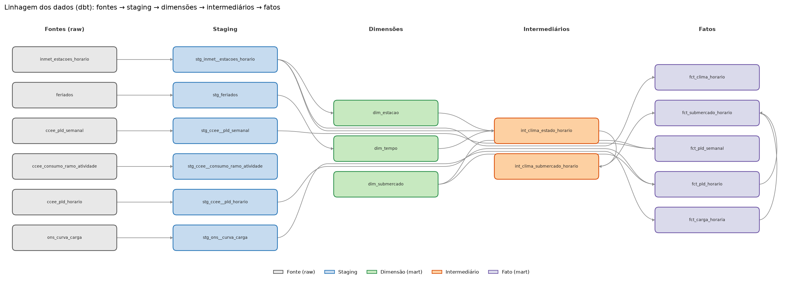

# energia-livre-dados

## Como configurar o ambiente

```bash
uv sync                      # cria .venv e instala as dependências (Python 3.12)
cp .env.example .env         # preencha GCP_PROJECT_ID e GCS_BUCKET
gcloud auth application-default login
uv run pytest                # testes
uv run ruff check .          # lint
uv run ruff format .         # formatação
```

### dbt

```bash
cp dbt/profiles.yml.example dbt/profiles.yml   # perfil local (fica fora do git)
uv run --env-file .env dbt deps  --project-dir dbt --profiles-dir dbt   # instala o dbt_utils
uv run --env-file .env dbt debug --project-dir dbt --profiles-dir dbt   # confere a conexão
```

### Linhagem dos dados



Gerada do manifesto do dbt (`scripts/gerar_lineage.py`; as setas são os `ref` e `source` do código,
sem os testes de `relationships`). Para navegar pelo catálogo completo, com descrição de cada modelo
e coluna:

```bash
uv run --env-file .env dbt docs generate --project-dir dbt --profiles-dir dbt   # só lê metadados
uv run --env-file .env dbt docs serve    --project-dir dbt --profiles-dir dbt   # http://localhost:8080
uv run python scripts/verificar_docs.py   # confere que toda coluna real tem descrição
```

### Análise exploratória

`notebooks/01_exploracao.ipynb` lê só dos marts (com o teto de custo por consulta) e gera as figuras de
`docs/figuras/`: [carga mensal do SE](docs/figuras/01_carga_mensal_se.png),
[perfil por hora e tipo de dia](docs/figuras/02_perfil_horario_por_tipo_de_dia.png),
[carga contra temperatura](docs/figuras/03_carga_x_temperatura.png),
[PLD do SUDESTE por ano](docs/figuras/04_pld_se_por_ano.png) e
[PLD médio anual](docs/figuras/05_pld_medio_anual.png). O notebook é versionado **sem saídas**
(`nbstripout`); depois de clonar, rode `uv run nbstripout --install` uma vez.

```bash
uv run --env-file .env --with jupyterlab jupyter lab notebooks/
```
